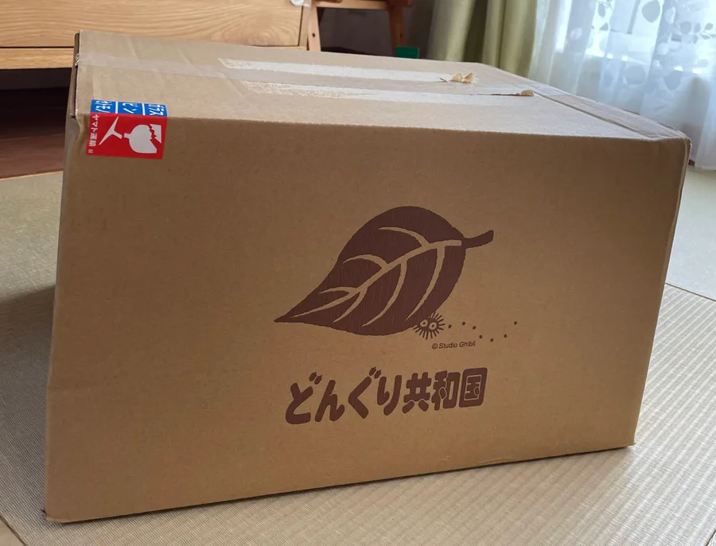
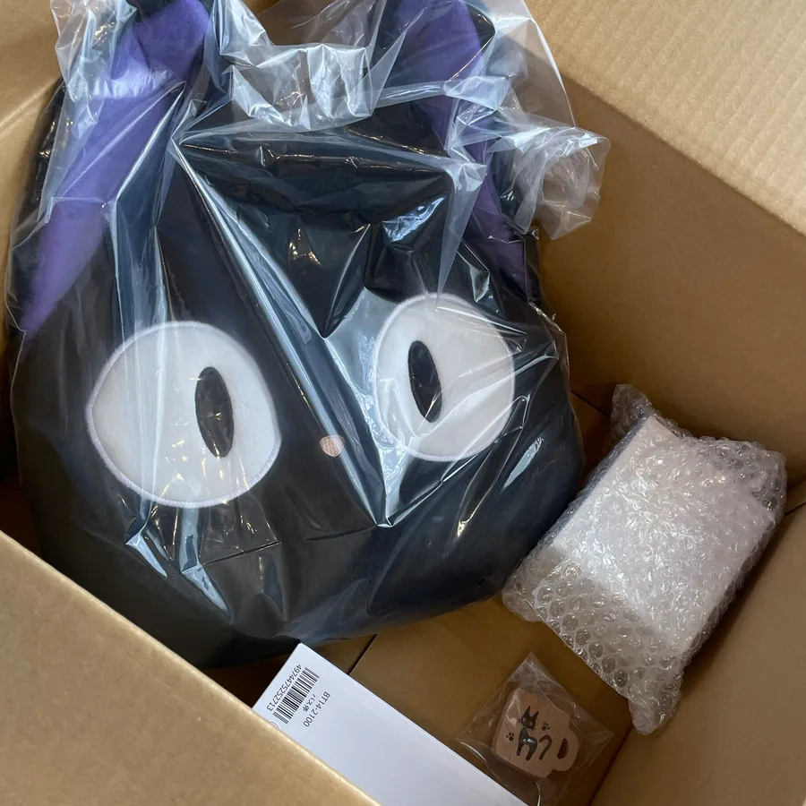

📌 この記事でわかること

ドングリ共和国そらのうえてんで購入したジブリグッズ 実際に買ったアイテムの価格や感想 予算を超えてでも買いたくなった理由 再入荷・在庫少なめアイテムとの出会い ジブリグッズを“後悔しないタイミング”で買う楽しさ

月5000円の予算を決めて、無理せず楽しくジブリグッズを楽しむこのシリーズ。

今月も、ちいさな“好き”を見つけにドングリ共和国へ行ってきました✨

「どんなグッズがあるの？」「予算内で楽しめる？」

そんな方の参考にもなればうれしいです◎

## H2：ドングリ共和国に行ってきました｜5月の満喫day🍃

今回は、ドングリ共和国そらのうえてんでお買い物🍃

気になっていたグッズたちを、オンラインでじっくり選びながらお迎えしました◎

ちなみに今回は送料無料ラインを超えたくて、気づけば「あとちょっと…！」と追加していった部分もあります😂

そして今回購入した「ドングリクローゼット」シリーズは、近くのドングリ共和国実店舗では見かけないアイテム。

つまりオンラインでしか買えない…！となると、つい欲しくなってしまいますよね✨😂

## H2：今回仲間入りしたジブリグッズたち【購入品一覧】

### ① 魔女の宅急便 ジジマグカップ ミント（税込1,980円）

前から欲しかったミントカラーがまさかの再入荷！

以前買い逃した経験があったので、「これは今買わないと後悔するやつ…！」と即カゴ行きでした◎

やさしいミントカラーと、ちょこんといるジジがとにかくかわいい。

使うたびに気分が上がりそうなマグカップです☕

※ドングリクローゼットシリーズ

### ② 魔女の宅急便 木製マグネット ジジ ナチュラル（税込1,430円）

ピンクバージョンは持っていたのですが、今回ナチュラルカラーを発見！

こちらも「次来た時にはないかも…」という予感がして即購入でした🍃

木のやさしい質感とジジの組み合わせがすごくかわいい…！

冷蔵庫やデスクまわりに飾るだけで癒されます

※ドングリクローゼットシリーズ

### ③ となりのトトロ 信号看板オブジェ ネコバス（税込2,420円）

これは前からずっと気になっていたアイテム！

家にあるネコバスの陶器と並べて飾りたいな〜と思っていたのですが、今回ドングリ共和国そらのうえてんでも同じようにディスプレイされていて、

「やっぱりその飾り方したくなるよね！！」となりました🍃

さらに、近くのドングリ共和国実店舗でも「残り1個（現品限り）」みたいな表記を見た気がして…。

これはもう無くなる前に買っておこう！と決断しました◎

### ④ 魔女の宅急便 クッション ジジと一緒（税込3,300円）

今回かなり悩みつつも、お迎えを決めたのがこちら。

ポイントは、“ダイカットじゃない”タイプなこと！

今ってダイカットクッションが主流なんですが、個人的には昔からある普通の形のクッションのほうが、お顔の雰囲気が好きなんです🍃

家には中トトロ・小トトロ・ネコバスの同シリーズがいるので、今回ジジも仲間入り✨

最近あまり見かけなくなってきたので、「販売終了になる前に確保しておきたい…！」という気持ちもありました◎

## H2：今月のお買い物まとめ｜合計金額と予算

### 合計金額はこちら

今回購入した4点の合計金額はこちら！

魔女の宅急便 ジジマグカップ ミント（税込1,980円）

魔女の宅急便 木製マグネット ジジ ナチュラル（税込1,430円）

となりのトトロ 信号看板オブジェ ネコバス（税込2,420円）

魔女の宅急便 クッション ジジと一緒（税込3,300円）

👉 合計：税込9,130円！

送料無料ラインを目指した結果、気づけばしっかり9,000円超えでした😂

### 今月の予算について

毎月のお小遣いは¥5,000。

先月繰越：-45円

今月ジブリ予算：+5,000円

👉 今月使える予算：4,955円

### 予算内に収まった？結果発表

予算：4,9５５円

使用合計額：9,130円

👉 結果、しっかり予算オーバー！！😂

もはや最近は安定の予算オーバーです。笑

でも今回は、

再入荷アイテム

在庫少なめっぽい商品

今後なくなりそうなデザイン

が重なっていたので、個人的にはかなり満足度高めのお買い物でした🍃

## H2：今月いちばんのお気に入り｜となりのトトロ 信号看板オブジェ ネコバス

#### 🍃お気に入りの理由

今回いちばんテンションが上がったのは、やっぱりネコバスのバス停！

こういう“わかる人にはわかる”感じのグッズ、たまらないんですよね…。

普通のぬいぐるみや雑貨とはまた違う、「トトロの世界観を部屋に作れる」感じがすごく好き🍃

コアファン感が強くて、コレクター欲をしっかり満たしてくれるアイテムでした◎

#### 🍃実際に飾ってみた感想

家にあるネコバス陶器と並べて飾ってみたら、想像以上によかった…！

ネコバス陶器の魅力も引き立つし、バス停側もちゃんと存在感がある。

単体でもかわいいんですが、並べた瞬間に一気に“トトロの世界”になる感じが最高でした✨

## H2：今月もいい買い物でした｜満足度と振り返り

今月は、「新しく何かに一目惚れ！」というよりも、

欲しかったカラーを手に入れる

再入荷アイテムを確保する

品切れ前にお迎えする

みたいな、“補う買い物”が多めの満喫dayでした🍃

でもその分、「あの時買っておけばよかった…！」を回避できた満足感がかなり大きい！

特に今回は、

前から狙っていたミントカラーのマグカップ

ナチュラルカラーの木製マグネット

気になっていたネコバスのバス停

最近減ってきた非ダイカットクッション

など、「今買えてよかった」と思えるものばかりでした✨

個人的にはかなり満足度高めのお買い物！

ちゃんと“後悔しない買い方”ができた気がします◎

## H2：来月もドングリ共和国へ｜気になるジブリグッズ

実は先月、「今度実店舗で見たいな〜」と思っていた気になるグッズたち。

……見る前にオンラインで買ってしまいました😂笑

やっぱり在庫状況とか再入荷を見ると、つい焦ってしまうんですよね。

なので来月こそは！

ちゃんとドングリ共和国の実店舗にも行きたいと思います🍃

まだまだ気になるジブリグッズは尽きません…！✨